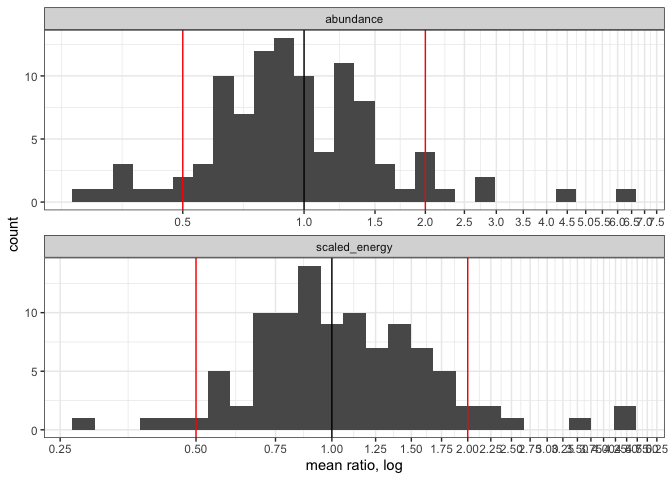

a trimmed-ish draft
================

``` r
knitr::opts_chunk$set(echo = FALSE)
#knitr::opts_chunk$set(fig.dim = c(5,3))

library(dplyr)
```

    ## 
    ## Attaching package: 'dplyr'

    ## The following objects are masked from 'package:stats':
    ## 
    ##     filter, lag

    ## The following objects are masked from 'package:base':
    ## 
    ##     intersect, setdiff, setequal, union

``` r
library(gratia)
library(ggplot2)
load_mgcv()

ts <- read.csv(here::here("analysis", "from_stories", "results", "ts_w_rescaled_e_100bbs.csv"))
```

    ## `summarise()` regrouping output by 'currency', 'identifier' (override with `.groups` argument)

    ## Joining, by = c("currency", "identifier", "k")

<!-- --><!-- -->

    ## `summarise()` ungrouping output (override with `.groups` argument)

    ## # A tibble: 2 x 7
    ##   currency      ntotal noverzero nincreasing ndecreasing ndouble nhalf
    ##   <chr>          <int>     <int>       <int>       <int>   <int> <int>
    ## 1 abundance        100        13          36          51       8     8
    ## 2 scaled_energy    100        10          45          45       6     4

<!-- -->

    ## `summarise()` ungrouping output (override with `.groups` argument)

    ## # A tibble: 3 x 2
    ##   e_n_compare  count
    ##   <chr>        <int>
    ## 1 abund_higher    12
    ## 2 abund_lower     35
    ## 3 overlap         53

<!-- -->
