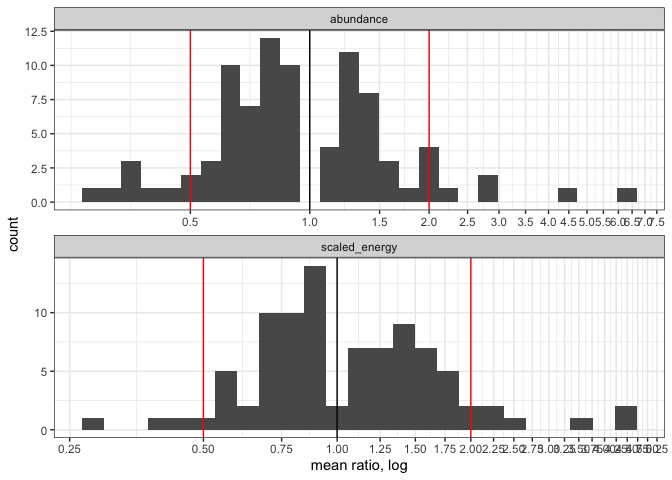

a trimmed-ish draft
================

``` r
knitr::opts_chunk$set(echo = FALSE)
#knitr::opts_chunk$set(fig.dim = c(5,3))

library(dplyr)
```

    ## 
    ## Attaching package: 'dplyr'

    ## The following objects are masked from 'package:stats':
    ## 
    ##     filter, lag

    ## The following objects are masked from 'package:base':
    ## 
    ##     intersect, setdiff, setequal, union

``` r
library(gratia)
library(ggplot2)
load_mgcv()

ts <- read.csv(here::here("analysis", "from_stories", "results", "ts_w_rescaled_e_100bbs.csv"))
```

    ## `summarise()` regrouping output by 'currency', 'identifier' (override with `.groups` argument)

    ## Joining, by = c("currency", "identifier", "k")

<!-- --><!-- -->

    ## `summarise()` ungrouping output (override with `.groups` argument)

<div class="kable-table">

| currency       | ntotal | noverzero | nincreasing | ndecreasing | ndouble | nhalf |
| :------------- | -----: | --------: | ----------: | ----------: | ------: | ----: |
| abundance      |    100 |        13 |          36 |          51 |       8 |     8 |
| scaled\_energy |    100 |        10 |          45 |          45 |       6 |     4 |

</div>

<!-- --><!-- -->

<!-- -->

    ## `summarise()` ungrouping output (override with `.groups` argument)

<div class="kable-table">

| e\_n\_compare | count |
| :------------ | ----: |
| abund\_higher |    12 |
| abund\_lower  |    35 |
| overlap       |    53 |

</div>

<!-- -->
