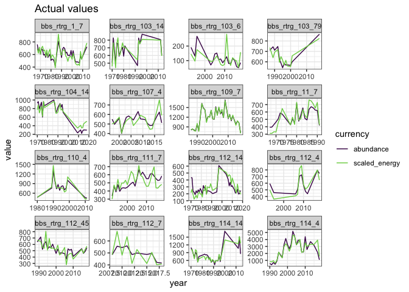
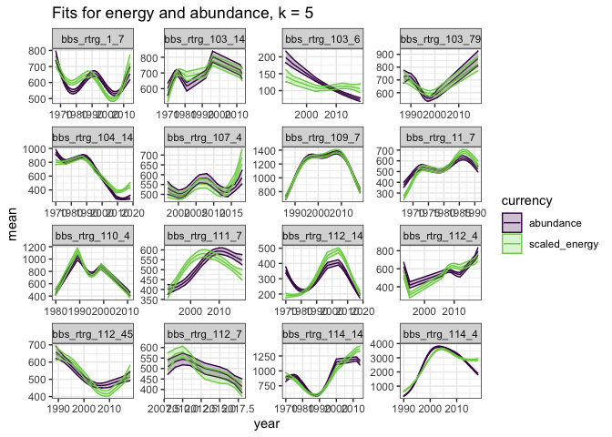
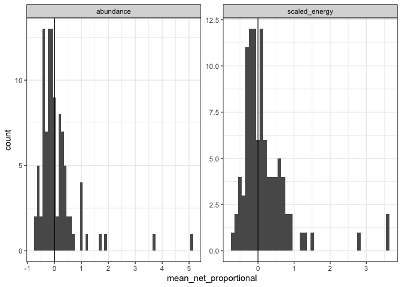
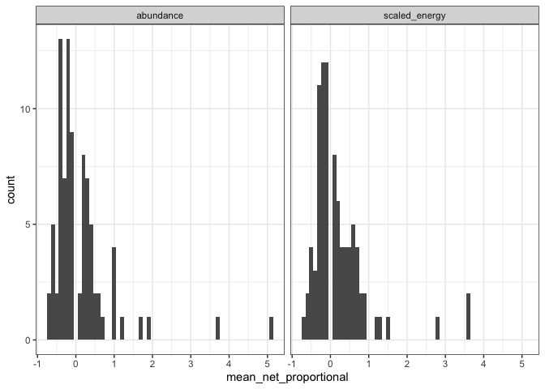
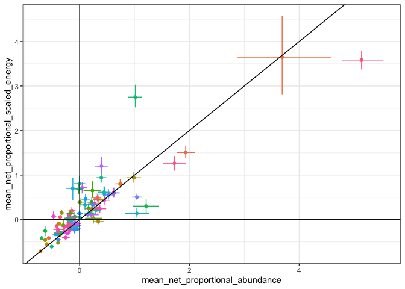
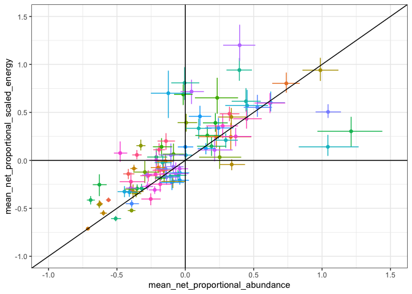
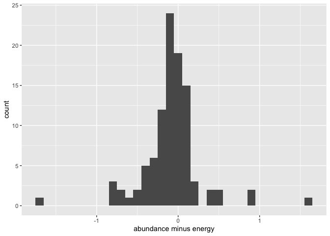
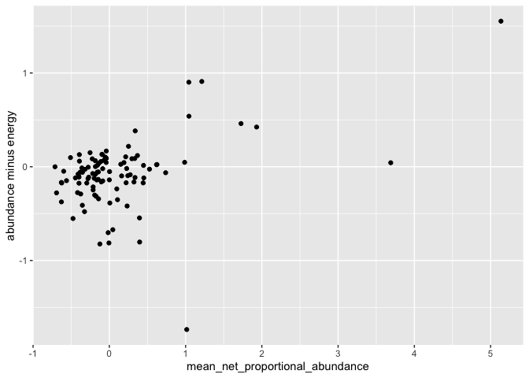

a trimmed-ish draft
================

``` r
knitr::opts_chunk$set(echo = FALSE)
#knitr::opts_chunk$set(fig.dim = c(5,3))

library(dplyr)
```

    ## 
    ## Attaching package: 'dplyr'

    ## The following objects are masked from 'package:stats':
    ## 
    ##     filter, lag

    ## The following objects are masked from 'package:base':
    ## 
    ##     intersect, setdiff, setequal, union

``` r
library(gratia)
library(ggplot2)
load_mgcv()

ts <- read.csv(here::here("analysis", "from_stories", "results", "ts_w_rescaled_e_100bbs.csv"))
```

<!-- -->

<!-- -->

<!-- --><!-- -->

    ## `summarise()` ungrouping output (override with `.groups` argument)

    ## # A tibble: 2 x 7
    ##   currency      ntotal noverzero nincreasing ndecreasing ndouble nhalf
    ##   <chr>          <int>     <int>       <int>       <int>   <int> <int>
    ## 1 abundance        100        13          36          51       8     8
    ## 2 scaled_energy    100        10          45          45       6     4

    ## `summarise()` regrouping output by 'currency' (override with `.groups` argument)

    ## # A tibble: 6 x 3
    ## # Groups:   currency [2]
    ##   currency      description mean_shift
    ##   <chr>         <chr>            <dbl>
    ## 1 abundance     decreasing     -0.314 
    ## 2 abundance     increasing      0.744 
    ## 3 abundance     over_zero      -0.0339
    ## 4 scaled_energy decreasing     -0.264 
    ## 5 scaled_energy increasing      0.668 
    ## 6 scaled_energy over_zero       0.0299

<!-- -->

    ## Warning: Removed 5 rows containing missing values (geom_point).

    ## Warning: Removed 5 rows containing missing values (geom_errorbarh).

<!-- -->

<!-- --><!-- -->
