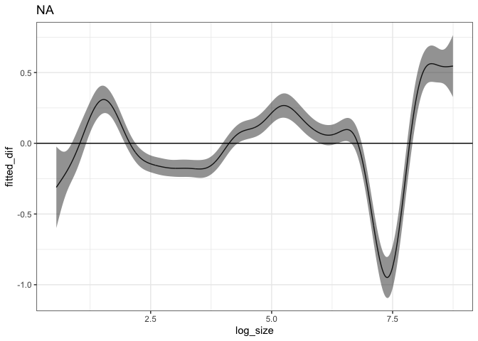

BBS route that goes by Hartland
================

### Load specific route

The New Hartford route goes up and down Riverton Road and was started in
1994. It feels pretty auspicious. It is route 102, region 18.

Here is how species richness, abundance, biomass, and energy have
changed over those years:

<!-- -->

## ISD

Using the logarithm of mass.

<!-- --><!-- --><!-- -->

    ## Loading required package: nlme

    ## 
    ## Attaching package: 'nlme'

    ## The following object is masked from 'package:dplyr':
    ## 
    ##     collapse

    ## This is mgcv 1.8-33. For overview type 'help("mgcv-package")'.

<!-- --><!-- --><!-- --><!-- --><!-- --><!-- -->

Reshuffling years…

    ## Joining, by = "year"

<!-- --><!-- -->

<!-- --><!-- --><!-- --><!-- --><!-- --><!-- -->

<!-- ### State variable change first-last -->

<!-- ```{r} -->

<!-- sv_periods <- data.frame(first5 = first5, -->

<!--                          last5 = last5) %>% -->

<!--   tidyr::pivot_longer(everything(), names_to = "period", values_to = "year") -->

<!-- sv_ends_long <- filter(sv_long, year %in% sv_periods$year) %>% -->

<!--   right_join(sv_periods)  -->

<!-- sv_ends <- filter(sv, year %in% sv_periods$year) %>% -->

<!--   right_join(sv_periods) %>% -->

<!--   mutate(period = as.factor(period)) -->

<!-- wilcox.test(abundance ~ period, data = sv_ends) -->

<!-- wilcox.test(biomass ~ period, data = sv_ends) -->

<!-- wilcox.test(mean_size ~ period, data = sv_ends) -->

<!-- t.test(abundance ~ period, data = sv_ends) -->

<!-- t.test(biomass ~ period, data = sv_ends) -->

<!-- t.test(mean_size ~ period, data = sv_ends) -->

<!-- ggplot(filter(sv_ends_long), aes(period, value, color = currency)) + -->

<!--   geom_boxplot() + -->

<!--   geom_point() + -->

<!--   facet_wrap(vars(currency), scales = "free", ncol = 4) -->

<!-- ggplot(filter(sv_ends_long, currency == "mean_size"), aes(period, value, color = currency)) + -->

<!--   geom_boxplot() + -->

<!--   geom_point() + -->

<!--   facet_wrap(vars(currency), scales = "free", ncol = 4) -->

<!-- ``` -->

<!-- ### State variable change GAMs -->

<!-- ```{r} -->

<!-- library(dplyr) -->

<!-- library(gratia) -->

<!-- library(ggplot2) -->

<!-- load_mgcv() -->

<!-- ts <- read.csv(here::here("analysis", "from_stories", "working_datasets.csv")) -->

<!-- unique_sites <- unique(ts$site_name) -->

<!-- site_dfs <- lapply(unique_sites, FUN = function(site, full_ts) return(filter(full_ts, site_name == site)), full_ts = ts) -->

<!-- source(here::here("analysis", "from_stories", "gam_fxns", "wrapper_fxns.R")) -->

<!-- source(here::here("analysis", "from_stories", "gam_fxns", "sunrise_fxns.R")) -->

<!-- ``` -->

<!-- ```{r just e portal, echo = F} -->

<!-- rats <- filter(ts, site_name == "hartland") -->

<!-- #portal_mean_perc_e <- sum(rats$energy) / sum(rats$abundance) -->

<!-- #  -->

<!-- # rats <- rats %>%  -->

<!-- #   mutate(scaled_energy = energy / portal_mean_perc_e, -->

<!-- #          mean_e = energy / abundance) -->

<!-- rats <- rats %>%  -->

<!--   mutate(mean_m = biomass / abundance) -->

<!-- rats_long <- rats %>% -->

<!--   select(year, biomass, abundance, mean_m) %>% -->

<!--   tidyr::pivot_longer(-year, names_to = "currency", values_to = "value") -->

<!-- ggplot(filter(rats_long), aes(year, value, color = currency)) + -->

<!--   geom_line() + -->

<!--   theme_bw() + -->

<!--   scale_color_viridis_d() + -->

<!--   facet_wrap(vars(currency), ncol = 1, scales = "free") -->

<!-- ``` -->

<!-- ```{r} -->

<!-- e_mod <- mod_wrapper(rats, response_variable = "biomass", identifier = "site_name", k = 5) -->

<!-- n_mod <- mod_wrapper(rats, response_variable = "abundance", identifier = "site_name", k = 5) -->

<!-- meane_mod <-  mod_wrapper(rats, response_variable = "mean_m", identifier = "site_name", k = 5) -->

<!-- e_samples <- samples_wrapper(e_mod, seed_seed = 1994) -->

<!-- n_samples <- samples_wrapper(n_mod, seed_seed = 1990) -->

<!-- meane_samples <- samples_wrapper(meane_mod, seed_seed = 1977) -->

<!-- joint_samples <- bind_rows(e_samples, n_samples, meane_samples) %>% -->

<!--   select(year, currency, mean, upper, lower) %>% -->

<!--   distinct() -->

<!-- ggplot(joint_samples, aes(year, mean, color = currency, fill = currency)) + -->

<!--   geom_line(aes(year, mean)) + -->

<!--   geom_ribbon(aes(year, ymin = lower, ymax = upper),  alpha = .25) + -->

<!--   ggtitle("Fits for energy and abundance") + -->

<!--   theme_bw() + -->

<!--   scale_color_viridis_d() + -->

<!--   scale_fill_viridis_d() + -->

<!--   facet_wrap(vars(currency), scales = "free", ncol = 1) -->

<!-- ``` -->

<!-- Calculated off the samples, we can get: -->

<!-- * the net change from beginning to end, plus a CI -->

<!-- * a timeseries of the instantaneous rate of change, which we can summarize in order to get a sense of how much backtracking is occurring over the course of the timeseries -->

<!-- ## Net change -->

<!-- ```{r shortcut to net change} -->

<!-- e_change <- net_change_wrapper(e_samples) -->

<!-- n_change <- net_change_wrapper(n_samples) -->

<!-- meane_change <- net_change_wrapper(meane_samples) -->

<!-- both_change <- bind_rows(e_change, n_change, meane_change) -->

<!-- ggplot(both_change, aes(currency, net_proportional, color = currency)) + -->

<!--   geom_boxplot() + -->

<!--   theme_bw() + -->

<!--   scale_color_viridis_d() -->

<!-- both_summary <- change_summary_wrapper(both_change) -->

<!-- both_summary -->

<!-- ``` -->
