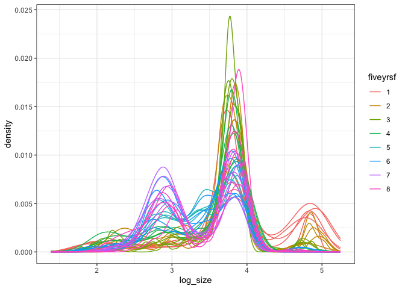

BBS route that goes by Hartland
================

### Load specific route

The New Hartford route goes up and down Riverton Road and was started in
1994. It feels pretty auspicious. It is route 102, region 18.

    ## Loading in data version 2.49.0

## ISD

Using the logarithm of mass.

<!-- --><!-- --><!-- -->

    ## Loading required package: nlme

    ## 
    ## Attaching package: 'nlme'

    ## The following object is masked from 'package:dplyr':
    ## 
    ##     collapse

    ## This is mgcv 1.8-33. For overview type 'help("mgcv-package")'.

<!-- --><!-- --><!-- --><!-- --><!-- --><!-- -->

Questions:

1.  There’s a *significant* difference but what is the magnitude of it?

<!-- end list -->

    ## Joining, by = "row"

<!-- --><!-- --><!-- -->

| draw |   overlap |
| :--- | --------: |
| 1    | 0.4000986 |
| 2    | 0.4148040 |
| 3    | 0.4080404 |
| 4    | 0.4057805 |
| 5    | 0.4428706 |
| 6    | 0.4163015 |
| 7    | 0.4057705 |
| 8    | 0.3704419 |
| 9    | 0.4030555 |
| 10   | 0.4002783 |

<!-- -->

|  overlap |
| -------: |
| 0.607919 |

    ## `summarise()` has grouped output by 'log_size'. You can override using the `.groups` argument.

<!-- --><!-- -->

    ## [1] 0.5947542
