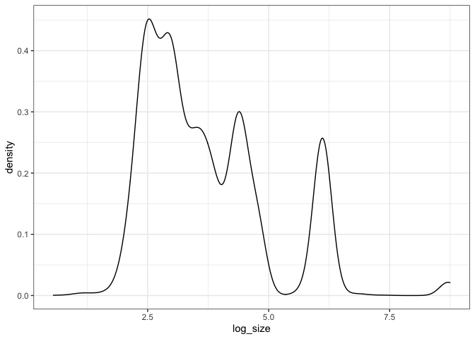
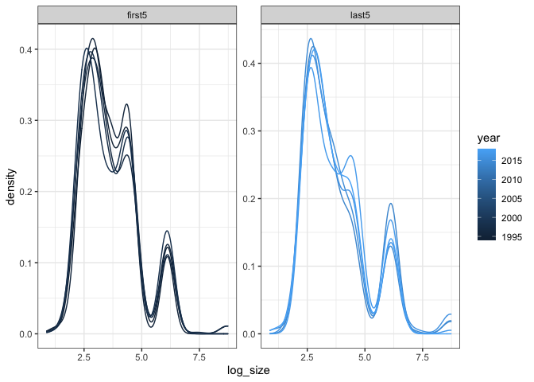

BBS route that goes by Hartland
================

### Load specific route

The New Hartford route goes up and down Riverton Road and was started in
1994. It feels pretty auspicious. It is route 102, region 18.

Here are the species present in this route over the past 25 years:

    ## `summarise()` ungrouping output (override with `.groups` argument)

Here is how species richness, abundance, biomass, and energy have
changed over those years:

    ## `summarise()` ungrouping output (override with `.groups` argument)

<!-- -->

## ISD

Using the logarithm of mass.

<!-- --><!-- --><!-- -->

The overlap for these is `0.9237467`.

Resampling from the combined KDE:

    ## [1] 1

<!-- --><!-- --><!-- -->
\#\#\# State variable change first-last

    ## Joining, by = "year"
    ## Joining, by = "year"

    ## Warning in wilcox.test.default(x = c(466L, 508L, 569L, 599L, 475L), y =
    ## c(569L, : cannot compute exact p-value with ties

    ## 
    ##  Wilcoxon rank sum test with continuity correction
    ## 
    ## data:  abundance by period
    ## W = 18.5, p-value = 0.2492
    ## alternative hypothesis: true location shift is not equal to 0

    ## 
    ##  Wilcoxon rank sum exact test
    ## 
    ## data:  biomass by period
    ## W = 7, p-value = 0.3095
    ## alternative hypothesis: true location shift is not equal to 0

    ## 
    ##  Wilcoxon rank sum exact test
    ## 
    ## data:  mean_size by period
    ## W = 4, p-value = 0.09524
    ## alternative hypothesis: true location shift is not equal to 0

    ## 
    ##  Welch Two Sample t-test
    ## 
    ## data:  abundance by period
    ## t = 1.183, df = 7.4341, p-value = 0.2733
    ## alternative hypothesis: true difference in means is not equal to 0
    ## 95 percent confidence interval:
    ##  -50.13532 152.93532
    ## sample estimates:
    ## mean in group first5  mean in group last5 
    ##                523.4                472.0

    ## 
    ##  Welch Two Sample t-test
    ## 
    ## data:  biomass by period
    ## t = -1.5195, df = 6.7133, p-value = 0.1742
    ## alternative hypothesis: true difference in means is not equal to 0
    ## 95 percent confidence interval:
    ##  -70577.97  15648.11
    ## sample estimates:
    ## mean in group first5  mean in group last5 
    ##             53892.58             81357.51

    ## 
    ##  Welch Two Sample t-test
    ## 
    ## data:  mean_size by period
    ## t = -2.2407, df = 5.7822, p-value = 0.06795
    ## alternative hypothesis: true difference in means is not equal to 0
    ## 95 percent confidence interval:
    ##  -142.468386    6.919953
    ## sample estimates:
    ## mean in group first5  mean in group last5 
    ##             100.6468             168.4210

<!-- --><!-- -->

### State variable change GAMs

<!-- -->

    ## Joining, by = "row"
    ## Joining, by = "row"
    ## Joining, by = "row"

<!-- -->

Calculated off the samples, we can get:

  - the net change from beginning to end, plus a CI
  - a timeseries of the instantaneous rate of change, which we can
    summarize in order to get a sense of how much backtracking is
    occurring over the course of the timeseries

## Net change

<!-- -->

    ## `summarise()` regrouping output by 'currency' (override with `.groups` argument)

| currency  | identifier | mean\_net\_proportional | lower\_net\_proportional | upper\_net\_proportional |
| :-------- | :--------- | ----------------------: | -----------------------: | -----------------------: |
| abundance | hartland   |             \-0.1737103 |              \-0.2367634 |              \-0.0961954 |
| biomass   | hartland   |               0.5279575 |                0.5157508 |                0.5382951 |
| mean\_m   | hartland   |               0.8672767 |                0.5452759 |                1.2445816 |

