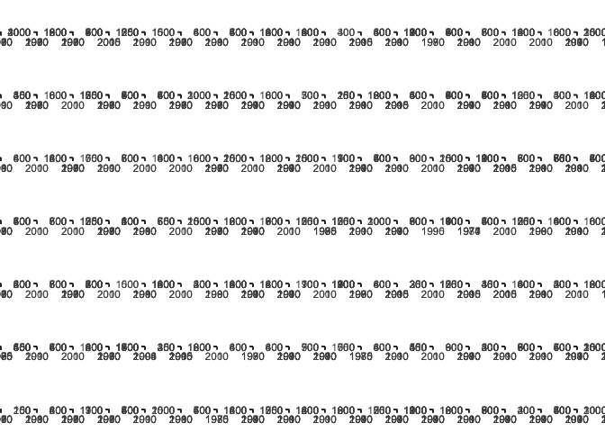

Summary Report
================
Author
2020-01-09

Read in the results
-------------------

``` r
all_agg = readd(all_agg)
```

Plot
----

``` r
ggplot(all_agg, aes(x = year, y = totalabund)) +
  geom_point() +
  geom_smooth(method="lm", se=FALSE) +  facet_wrap(vars(route, region), scales = "free") +
  theme_bw() 
```


