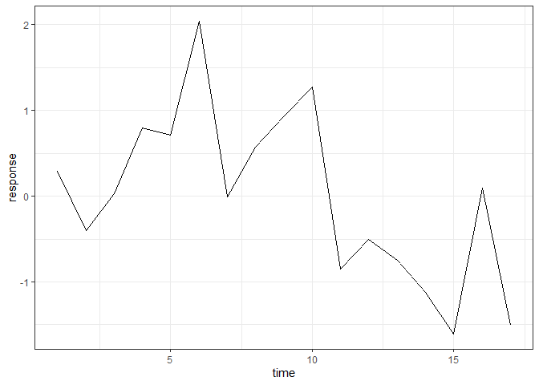
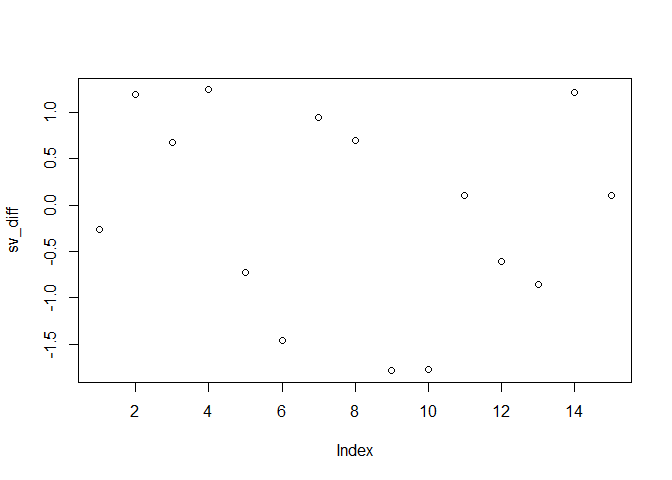

Summary Report
================
Ren
2020-06-05

``` r
loadd(sv_bbs_rtrg_1_4)

ggplot(sv_bbs_rtrg_1_4, aes(x = time, y = response)) +
  geom_line() +
  theme_bw()
```

<!-- -->

Ok, scaling:

``` r
sv_bbs_rtrg_1_4 <- sv_bbs_rtrg_1_4 %>%
  mutate(response = scale(sqrt(response)))


ggplot(sv_bbs_rtrg_1_4, aes(x = time, y = response)) +
  geom_line() +
  theme_bw()
```

<!-- -->

``` r
sv_lm <- lm(sv_bbs_rtrg_1_4, formula = response ~ time)

summary(sv_lm)
```

    ## 
    ## Call:
    ## lm(formula = response ~ time, data = sv_bbs_rtrg_1_4)
    ## 
    ## Residuals:
    ##     Min      1Q  Median      3Q     Max 
    ## -1.1668 -0.6247 -0.2304  0.4665  1.7095 
    ## 
    ## Coefficients:
    ##             Estimate Std. Error t value Pr(>|t|)  
    ## (Intercept)  0.98686    0.43629   2.262   0.0390 *
    ## time        -0.10965    0.04258  -2.575   0.0211 *
    ## ---
    ## Signif. codes:  0 '***' 0.001 '**' 0.01 '*' 0.05 '.' 0.1 ' ' 1
    ## 
    ## Residual standard error: 0.86 on 15 degrees of freedom
    ## Multiple R-squared:  0.3066, Adjusted R-squared:  0.2604 
    ## F-statistic: 6.632 on 1 and 15 DF,  p-value: 0.02111

``` r
plot(sv_lm)
```

<!-- --><!-- --><!-- --><!-- -->

The residuals don’t look uniform and are def not normal.

``` r
library(tseries)
```

    ## Registered S3 method overwritten by 'quantmod':
    ##   method            from
    ##   as.zoo.data.frame zoo

``` r
sv_adf <- adf.test(sv_bbs_rtrg_1_4$response)

sv_adf
```

    ## 
    ##  Augmented Dickey-Fuller Test
    ## 
    ## data:  sv_bbs_rtrg_1_4$response
    ## Dickey-Fuller = -2.5109, Lag order = 2, p-value = 0.3778
    ## alternative hypothesis: stationary

Fails to reject the null, that there is a unit root.

This means OLS isn’t applicable.

Try differencing the TS to obtain a stationary TS?

``` r
sv_diff <- diff(sv_bbs_rtrg_1_4$response, lag = 2)

plot(sv_diff)
```

<!-- -->
