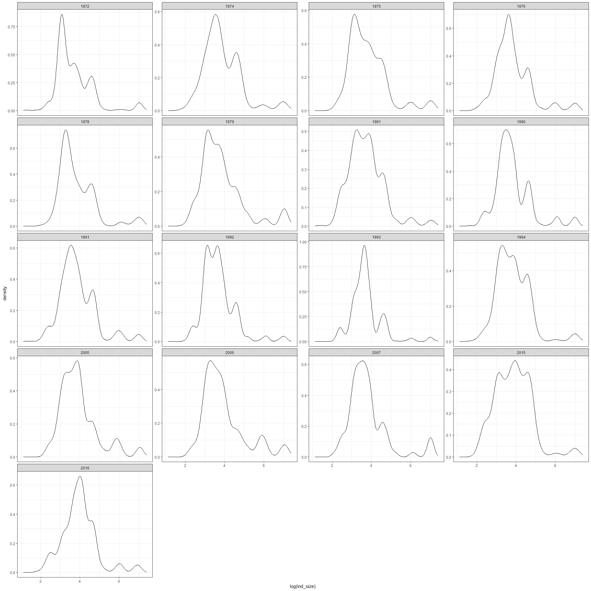
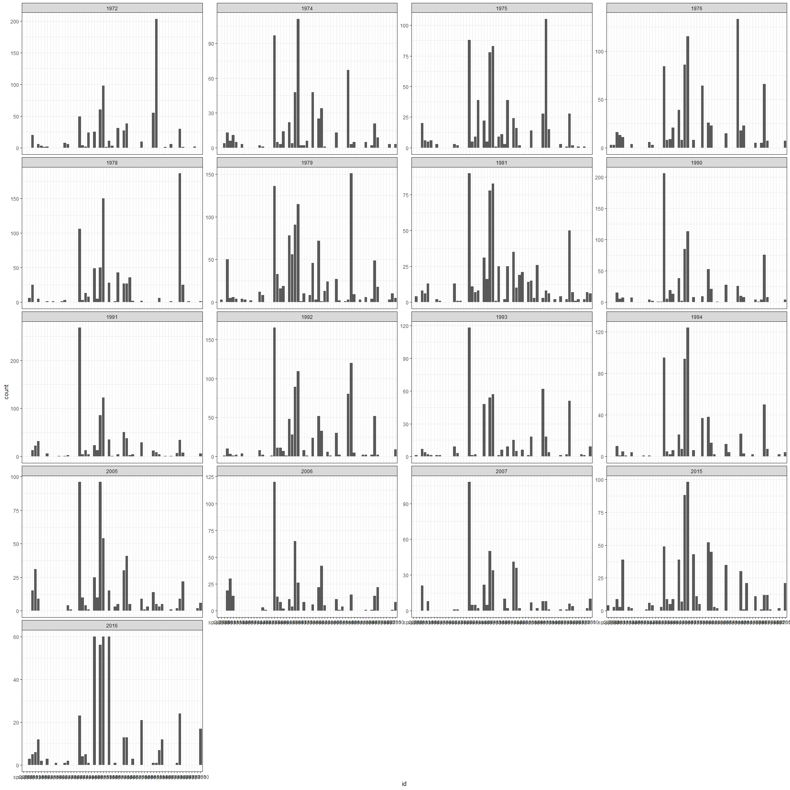

A deep dive
================

Here I have loaded the IBD which includes a size estimate and metabolic
rate estimate, and species ID, for every individual at every time point.

    ##   year     id ind_size    ind_b
    ## 1 1972 sp3091 1138.126 1585.817
    ## 2 1972 sp3091 1072.945 1520.517
    ## 3 1972 sp3091 1159.999 1607.487
    ## 4 1972 sp3091 1157.852 1605.366
    ## 5 1972 sp3091 1153.650 1601.209
    ## 6 1972 sp3091 1138.062 1585.754

We can use the IBD to compute aggregate metrics per year.

    ## # A tibble: 6 x 7
    ##    year totalind  nspp totalmass totalenergy meanmass meanenergy
    ##   <int>    <int> <int>     <dbl>       <dbl>    <dbl>      <dbl>
    ## 1  1972      727    28    57999.     142382.     79.8       196.
    ## 2  1974      598    33    55402.     133722.     92.6       224.
    ## 3  1975      677    33    63266.     149624.     93.5       221.
    ## 4  1976      829    29    71567.     177016.     86.3       214.
    ## 5  1978      812    29    77373.     181001.     95.3       223.
    ## 6  1979     1110    41   125031.     271056.    113.        244.

Let’s plot the aggregate metrics over time.

    ## `geom_smooth()` using formula 'y ~ x'

<!-- -->

    ## `geom_smooth()` using formula 'y ~ x'

<!-- -->

    ## `geom_smooth()` using formula 'y ~ x'

<!-- -->

    ## `geom_smooth()` using formula 'y ~ x'

<!-- --><!-- -->

    ## `geom_smooth()` using formula 'y ~ x'

<!-- -->

    ## `geom_smooth()` using formula 'y ~ x'

<!-- -->

<!-- -->

    ## 
    ## Call:
    ## lm(formula = value ~ year * currency, data = agg_for_lm)
    ## 
    ## Residuals:
    ##     Min      1Q  Median      3Q     Max 
    ## -1.1626 -0.6369 -0.2333  0.4335  2.7710 
    ## 
    ## Coefficients:
    ##                         Estimate Std. Error t value Pr(>|t|)  
    ## (Intercept)            65.250289  30.482554   2.141   0.0378 *
    ## year                   -0.032776   0.015311  -2.141   0.0378 *
    ## currencytotalind        9.823779  43.108841   0.228   0.8208  
    ## currencytotalmass      -4.795392  43.108841  -0.111   0.9119  
    ## year:currencytotalind  -0.004935   0.021653  -0.228   0.8208  
    ## year:currencytotalmass  0.002409   0.021653   0.111   0.9119  
    ## ---
    ## Signif. codes:  0 '***' 0.001 '**' 0.01 '*' 0.05 '.' 0.1 ' ' 1
    ## 
    ## Residual standard error: 0.8976 on 45 degrees of freedom
    ## Multiple R-squared:  0.2447, Adjusted R-squared:  0.1608 
    ## F-statistic: 2.916 on 5 and 45 DF,  p-value: 0.02304

<!-- --><!-- --><!-- --><!-- -->

The story I would tell from this is:

  - Overall declines in abundance more or less matching individuals and
    energy metrics; not a strong systematic functional shift.

Let’s look at the ISD by year? Will be big\!\!

<!-- -->

Just based on intuition, let’s contrast this with species histograms by
year…

<!-- -->

So now I would like to see plots of:

  - Pairwise ISD overlap (y) against distance in time (x).
  - Euclidean community distance (y) against distance in time (x).

It looks to me almost like the ISDs could be plausibly unordered: not
shifting directionally through time. Such that overlap should generally
be high, and there should not be a relationship between how far apart
years are and how similar they are. But that we might have seen
directional change in species composition, meaning that years farther
apart will be less similar than adjacent ones.

This isn’t what we get from these plots\! Not sure if that’s cause I’m
wrong, or because these plots aren’t sophisticated enough to handle
autocorrelation etc.

The one piece of this I think is really interesting (and I have some
confidence in) is, that Euclidean distance and overlap appear pretty
uncorrelated. I *think* this points to a large degree of functional
replacement of species: you can have high overlap with large distance,
if species 1 has replaced species 2 but they are the same size.

    ## Joining, by = "year"

    ## Joining, by = "species"
    ## Joining, by = "species"

<!-- -->

Similarity in species composition doesn’t appear to predict ISD overlap.

### Scrap

    ## `geom_smooth()` using formula 'y ~ x'

<!-- -->

OK, so it looks like there’s a weak decrease in overlap for years that
are farther apart.

    ## `geom_smooth()` using formula 'y ~ x'

<!-- -->

And if anything, years far apart are *closer* in Euclidean space.

    ## `geom_smooth()` using formula 'y ~ x'

<!-- -->

Looks like a drift away from starting conditions over time, but note
huge noise.

    ## `geom_smooth()` using formula 'y ~ x'

<!-- -->

In contrast composition doesn’t obviously drift, but still extremely
noisy.

    ## Joining, by = c("year1", "year2")

    ## `geom_smooth()` using formula 'y ~ x'

    ## Warning: Removed 1 rows containing non-finite values (stat_smooth).

    ## Warning: Removed 1 rows containing missing values (geom_point).

<!-- -->

Consecutive samples overlap *less* over time wrt ISD.

    ## `geom_smooth()` using formula 'y ~ x'

    ## Warning: Removed 1 rows containing non-finite values (stat_smooth).

    ## Warning: Removed 1 rows containing missing values (geom_point).

<!-- -->

Consecutive samples are *more* similar in species composition over time.
