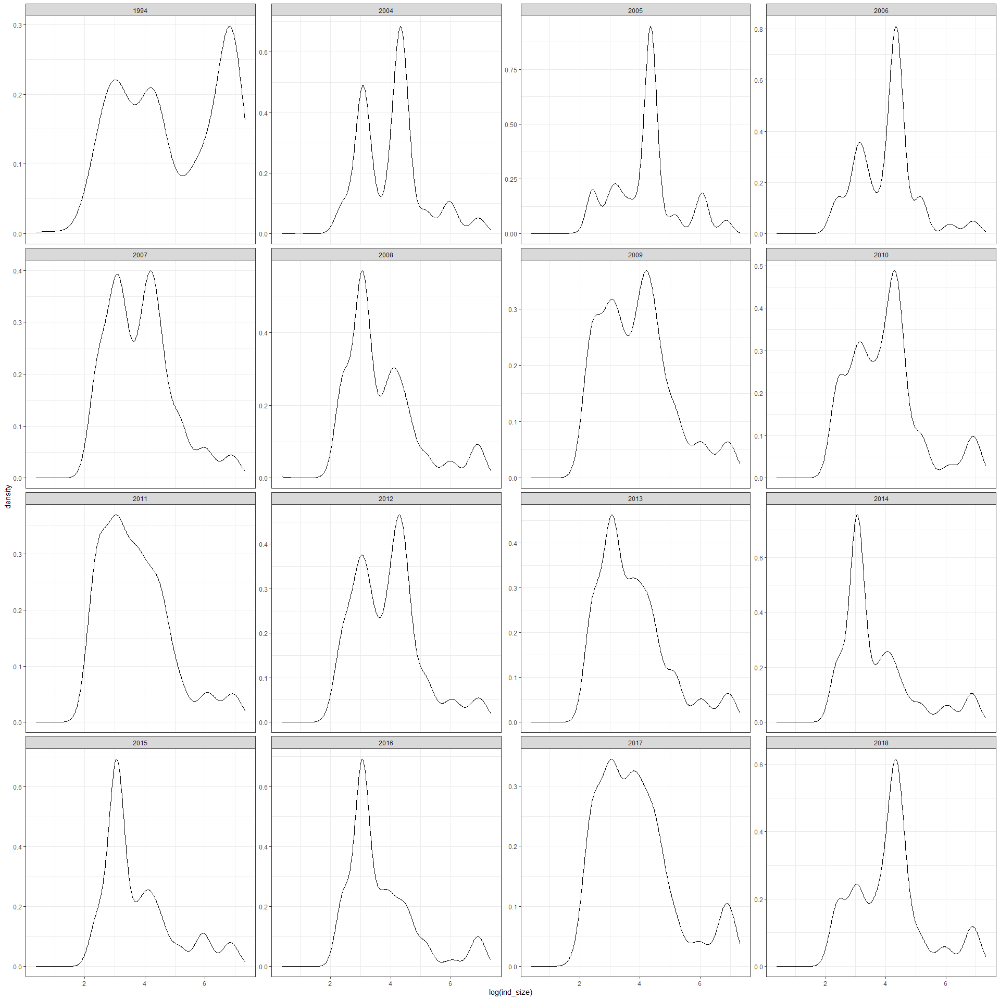
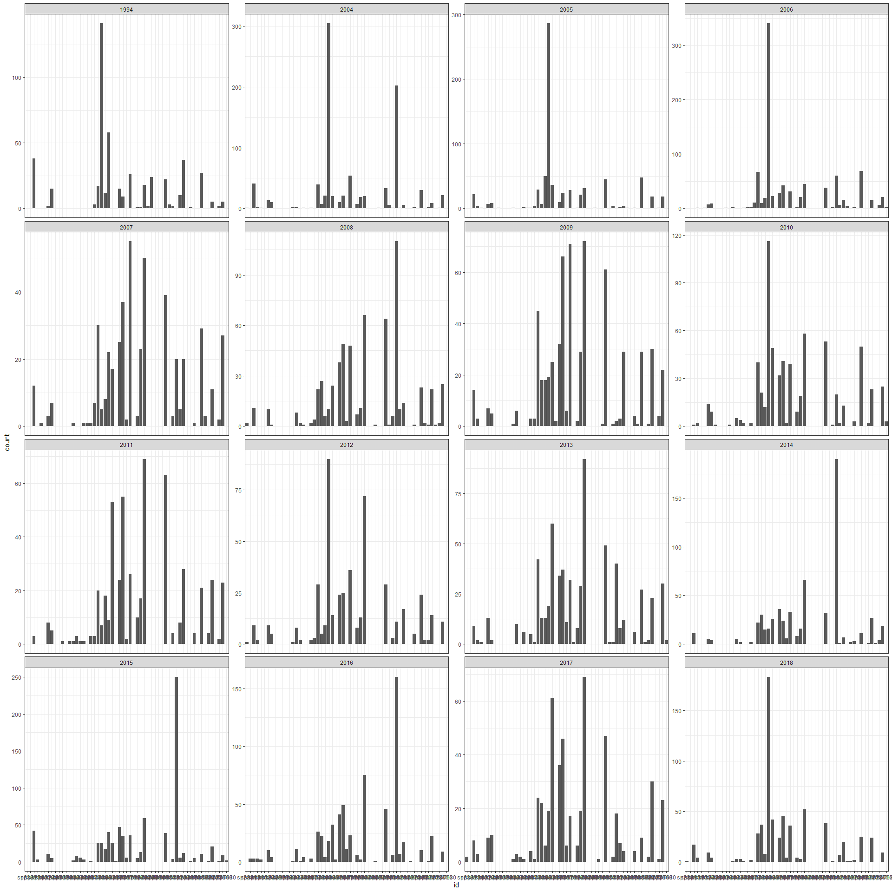

A deep dive
================

Here I have loaded the IBD which includes a size estimate and metabolic
rate estimate, and species ID, for every individual at every time point.

    ##   year     id ind_size    ind_b
    ## 1 1994 sp3131 305.5092 620.8856
    ## 2 1994 sp3131 330.7147 656.9913
    ## 3 1994 sp3131 368.7380 710.0014
    ## 4 1994 sp3131 364.8989 704.7228
    ## 5 1994 sp3131 354.0327 689.6952
    ## 6 1994 sp3131 359.0746 696.6842

We can use the IBD to compute aggregate metrics per year.

    ## # A tibble: 6 x 7
    ##    year totalind  nspp totalmass totalenergy meanmass meanenergy
    ##   <int>    <int> <int>     <dbl>       <dbl>    <dbl>      <dbl>
    ## 1  1994      496    26   183335.     301808.    370.        608.
    ## 2  2004      914    35   101989.     237532.    112.        260.
    ## 3  2005      715    33    91739.     208909.    128.        292.
    ## 4  2006      909    34    90144.     221514.     99.2       244.
    ## 5  2007      471    32    45909.     109287.     97.5       232.
    ## 6  2008      635    36    69274.     150302.    109.        237.

Let’s plot the aggregate metrics over time.

    ## `geom_smooth()` using formula 'y ~ x'

<!-- -->

    ## `geom_smooth()` using formula 'y ~ x'

<!-- -->

    ## `geom_smooth()` using formula 'y ~ x'

<!-- -->

    ## `geom_smooth()` using formula 'y ~ x'

<!-- --><!-- -->

    ## `geom_smooth()` using formula 'y ~ x'

<!-- -->

    ## `geom_smooth()` using formula 'y ~ x'

<!-- -->

<!-- -->

    ## 
    ## Call:
    ## lm(formula = value ~ year * currency, data = agg_for_lm)
    ## 
    ## Residuals:
    ##      Min       1Q   Median       3Q      Max 
    ## -1.59187 -0.61183  0.00938  0.41974  1.92515 
    ## 
    ## Coefficients:
    ##                          Estimate Std. Error t value Pr(>|t|)   
    ## (Intercept)             2.142e+02  7.483e+01   2.863  0.00653 **
    ## year                   -1.066e-01  3.723e-02  -2.863  0.00653 **
    ## currencytotalind       -1.897e+02  1.058e+02  -1.793  0.08022 . 
    ## currencytotalmass       5.616e+00  1.058e+02   0.053  0.95792   
    ## year:currencytotalind   9.439e-02  5.265e-02   1.793  0.08021 . 
    ## year:currencytotalmass -2.794e-03  5.265e-02  -0.053  0.95792   
    ## ---
    ## Signif. codes:  0 '***' 0.001 '**' 0.01 '*' 0.05 '.' 0.1 ' ' 1
    ## 
    ## Residual standard error: 0.8738 on 42 degrees of freedom
    ## Multiple R-squared:  0.2873, Adjusted R-squared:  0.2025 
    ## F-statistic: 3.386 on 5 and 42 DF,  p-value: 0.01167

<!-- --><!-- --><!-- --><!-- -->

This story is one that I systematically found because it’s unlike most
of the others: the three currencies are **decoupled**. This is pretty
much 100% because of the first time point, which has low individual
abundance but high biomass & energy. Even here the interaction of
currency \* time is not significant to .05. However, we do see it borne
out in changes in a) the ISDs and b) the overlap of ISDs.

For the ISDs, we see 1994 has a peak at large body size that is absent
in the 2000s:

<!-- -->

Hard to get anything out of the species hists…

<!-- -->

    ## Joining, by = "year"

    ## Joining, by = "species"
    ## Joining, by = "species"

<!-- -->

This really highlights the downside of this plot: All the ones down low
are the comparisons to 1994.

Aside from that, it *does* look like more similarity in species //
overlap…

### Scrap

    ## `geom_smooth()` using formula 'y ~ x'

<!-- -->

1994 really drives this line. You only get 15 year distances for the
1994 comparison…

    ## `geom_smooth()` using formula 'y ~ x'

<!-- -->

Interestingly, species composition doesn’t have the same signal as
overlap does. Suspect this is because the loss of a large species has a
lot of leverage on the ISD and relatively little impact on species
composition, because it involves relatively few individuals.

    ## `geom_smooth()` using formula 'y ~ x'

<!-- -->

Note y axis range. All the years not 1994 overlap relatively little with
1994. Later years seem to overlap less, but I have low confidence in
that trend.

    ## `geom_smooth()` using formula 'y ~ x'

<!-- -->

In contrast, those same later years are actually closer to 1994 than the
early 2000s.

    ## Joining, by = c("year1", "year2")

    ## `geom_smooth()` using formula 'y ~ x'

    ## Warning: Removed 1 rows containing non-finite values (stat_smooth).

    ## Warning: Removed 1 rows containing missing values (geom_point).

<!-- -->

    ## `geom_smooth()` using formula 'y ~ x'

    ## Warning: Removed 1 rows containing non-finite values (stat_smooth).

    ## Warning: Removed 1 rows containing missing values (geom_point).

<!-- -->

1994 is a weirdo.
